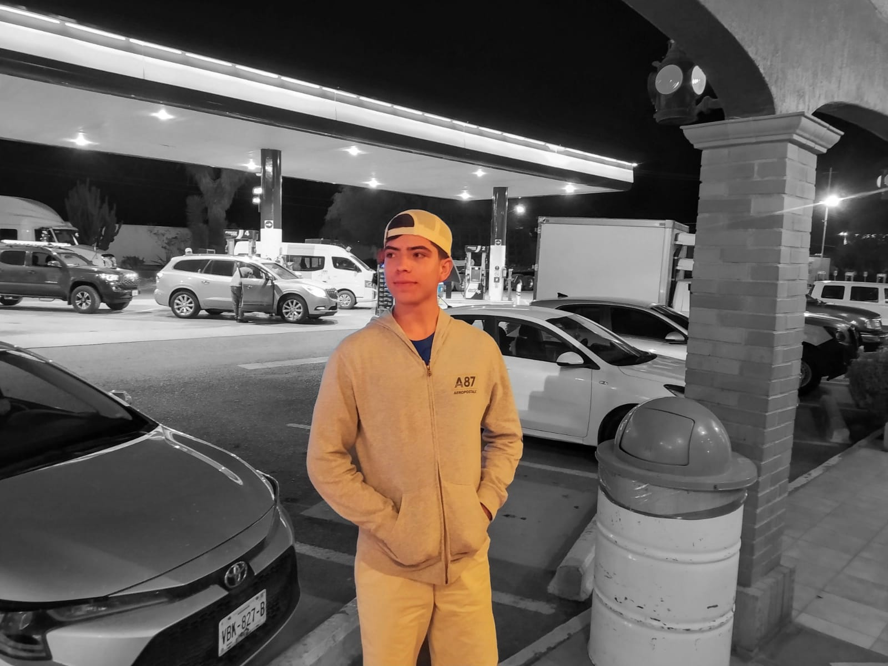

# Roberto Carlos Martinez Aviña's Resume

This is the online resume of Roberto Carlos Martinez Aviña, created to professionally and accessibly represent my experience, skills, and projects.

## Description

This website showcases information about my academic background, work experience, skills, and notable projects. It is designed to be a useful tool in job searching and presenting my professional profile.

## Content

- **Personal Information**: Details about my academic background and contact information.
- **Work Experience**: Information about my previous jobs and roles held.
- **Skills**: A summary of my technical and professional skills.
- **Projects**: Examples of relevant projects I have worked on.

## Technologies Used

- HTML
- CSS

## Website Link

You can view the resume online at [GitHub Pages](https://robertomtzgit.github.io/CV_RCMA/).

## Screenshots

## Contributions

If you would like to contribute to this project, please contact me.

## License

This project is licensed under the [MIT License](LICENSE).
